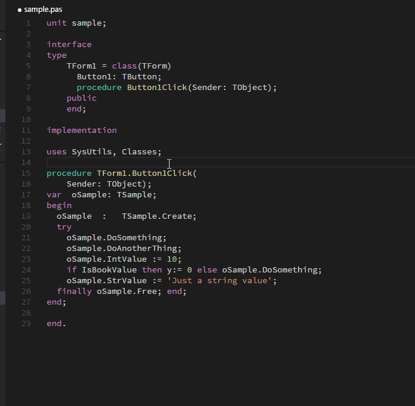

# Pascal for Visual Studio Code

This extension adds support for the Pascal Language to Visual Studio Code. It works with Delphi and FreePascal/Lazarus and supports:

* Colorization
* Snippets
* Format Code
* Task Build
* Go to Symbol

# Installation

Press `F1` in VSCode, type `ext install` and then look for `Language Pascal`.

# Usage

## Colorization

Full syntax highlight for Pascal


## Snippets

Almost 40 snippets available:


## Format Code

> _new in version 0.3.0_  

Standardise your Pascal code! The extension uses external tools _(engines)_ to format the code, so you must install them prior to use the `Format Code` command.

* **Jedi Code Format:** http://jedicodeformat.sourceforge.net/ (Windows only)
* **FreePascal PToP:** http://wiki.freepascal.org/PTop (Windows, Linux and Mac OS X)

> If you intend to format _pieces of selected texts_ instead of _the entire file_, you should use **FreePascal PToP**, because the **Jedi Code Format** only works for entire files. 

## Go to Symbol

> _new in version 0.4.0_  

Easily navigate to methods (procedures and functions) inside Pascal files.

It uses GNU Global, a source code tagging system, which means that it has some limitations if you compare with an AST parsing.

#### Installing and Configuring GNU Global

1. You have to install 4 tools:

 * GNU GLobal 6.5 or higher (http://www.gnu.org/software/global/global.html) 
 * Exuberant Tags 5.5 or higher (http://ctags.sourceforge.net/)
 * Python 2.7 or higher (https://www.python.org/)
 * Python Pygments (via `pip install Pygments`)

2. Update your `%PATH%` Environment Variable (_System_)

 Let's say you extract GNU Global and CTags in `C:\gnu` folder. The two new entries in `%PATH%` should be:
 
 * GNU Global: `C:\gnu\glo653wb\bin`
 * Excuberant Tags: `C:\gnu\ctags58\ctags58`

 Also make sure Python is in `%PATH%`

3. Create 2 new Environment Variables (_System_)

 GNU Global uses CTags + Python Pygments as plugin in order to recognizes Pascal source code, so you have to configure them. 
 
 * `GTAGSCONF`: `C:\gnu\glo653wb\share\gtags\gtags.conf` 
 * `GTAGSLABEL`: `pygments`


 
> **NOTE:** For now, it was tested only on Windows, but since these tools are multiplatform (in fact, it comes from Unix), it should work on Linux and Mac. I will update these instructions since I test on these platforms.

### Available settings

* Choose the engine to be used _(required)_
```
    // ptop means FreePascal PToP
    "pascal.formatter.engine": "ptop"
    
    // jcf means Jedi Code Format 
    "pascal.formatter.engine": "jcf"
```

* Indicates the engine app path _(required)_
```
    "pascal.formatter.enginePath": "C:\\FPC\\2.6.4\\bin\\i386-win32\\ptop.exe" 
```

* Indicates the configuration file for the selected engine _(optional)_
```
    "pascal.formatter.engineParameters": "C:\\FPC\\2.6.4\\bin\\i386-win32\\default.cfg"
```

### Available commands

The extension seamlessly integrates with the `Format Code` command in **Visual Studio Code**.



There is also:

* **Pascal: Edit Formatter Parameters** Opens/Generate the _parameters file_ for the selected engine

## Task Build

Use this **Task Examples**, so you can:

* Compile Delphi and FreePascal Projects:
* Navigate to _Errors/Warnings/Hints_, using the native _View / Errors and Warnings_ command

 

### Building Tasks

If you want to build tasks _(Task: Run Task Build)_ you can use the snippets below.

#### Delphi

Update two tags:

* `DCC32.EXE_PATH`: The compiler location
* `YOUR_DELPHI_PROJECT.DPR`: The project being built.

```
    {
		"version": "0.1.0",
		"windows": {
			"command": "DCC32.EXE_PATH"
		},
		"isShellCommand": true,
		"showOutput": "always",
		"args": ["YOUR_DELPHI_PROJECT.DPR"],
		"problemMatcher": {
			"owner": "external",
			"pattern": {
				"regexp": "^([\\w]+\\.(pas|dpr|dpk))\\((\\d+)\\)\\s(Fatal|Error|Warning|Hint):(.*)",
				"file": 1,
				"line": 3,
				"message": 5
			}
		}
    }
```

#### FreePascal

Update two tags:

* `FPC.EXE_PATH`: The compiler location
* `YOUR_FREEPASCAL_PROJECT`: The project being built.

```
    {
		"version": "0.1.0",
		"windows": {
			"command": "FPC.EXE_PATH"
		},
		"isShellCommand": true,
		"showOutput": "always",
		"args": ["YOUR_FREEPASCAL_PROJECT"],
		"problemMatcher": {
			"owner": "external",
			"pattern": {
				"regexp": "^([\\w]+\\.p)\\((\\d+)\\,(\\d+)\\)\\s(Fatal|Error|Warning|Note):(.*)",
				"file": 1,
				"line": 2,
				"column": 3,
				"message": 5
			}
		}
    }
```

# Changelog

## Version 0.4.0

* **New:** Go to Symbol

## Version 0.3.1

* **Fix:** Formatter settings not available (issue [#1](https://github.com/alefragnani/vscode-language-pascal/issues/1))

## Version 0.3.0

* **New:** Formatter added

## Version 0.2.0

* License updated

## Version 0.1.1

* Icon added for Marketplace

## Version 0.1.0

* Update to official guidelines

## Version 0.0.1

* Initial release

# License

[MIT](LICENSE.md) &copy; Alessandro Fragnani

---

[](https://www.paypal.com/cgi-bin/webscr?cmd=_donations&business=EP57F3B6FXKTU&lc=US&item_name=Alessandro%20Fragnani&item_number=vscode%20extensions&currency_code=USD&bn=PP%2dDonationsBF%3abtn_donate_SM%2egif%3aNonHosted) if you enjoy using this extension :-)