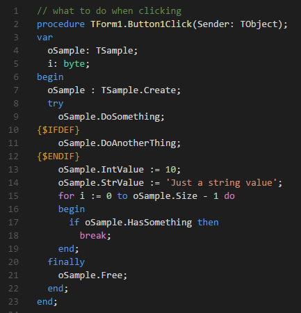
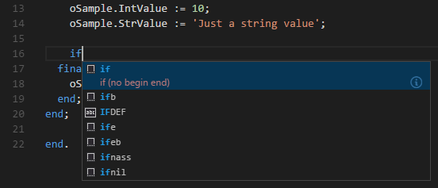
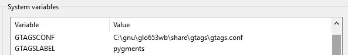
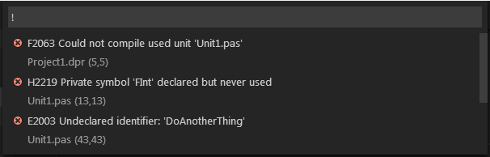

[](https://marketplace.visualstudio.com/items?itemName=alefragnani.pascal)
[](https://marketplace.visualstudio.com/items?itemName=alefragnani.pascal)
[](https://marketplace.visualstudio.com/items?itemName=alefragnani.pascal)

<p align="center">
  <br />
  <a title="Learn more about Pascal" href="http://github.com/alefragnani/vscode-language-pascal"></a>
</p>

# What's new in Pascal 9.9

* Adds more FreePascal Keywords
* Published to **Open VSX**
* Improves **Syntax Highlighting** support for FreePascal and Oxygene
* Adds **Web** support
* Adds **Getting Started / Walkthrough**

## Support

**Pascal** is an open source extension created for **Visual Studio Code**. While being free and open source, if you find it useful, please consider supporting it

<table align="center" width="60%" border="0">
  <tr>
    <td>
      <a title="Paypal" href="https://www.paypal.com/cgi-bin/webscr?cmd=_donations&business=EP57F3B6FXKTU&lc=US&item_name=Alessandro%20Fragnani&item_number=vscode%20extensions&currency_code=USD&bn=PP%2dDonationsBF%3abtn_donate_SM%2egif%3aNonHosted"></a>
    </td>
    <td>
      <a title="GitHub Sponsors" href="https://github.com/sponsors/alefragnani"></a>
    </td>
    <td>
      <a title="Patreon" href="https://www.patreon.com/alefragnani"></a>
    </td>
  </tr>
</table>

# Pascal

It adds support for the **Pascal** language and its dialects like **Delphi** and **FreePascal**. 

Here are some of the features that **Pascal** provides:

* **Syntax highlighting** for files, forms and projects
* A huge set of **Snippets**
* Source code **navigation** 

# Features

## Coding with style

### Syntax Highlighting

**Pascal** supports full syntax highlighting for **Delphi** and **FreePascal**



### Snippets

Almost 40 snippets are available



### Format Code

Check out [Pascal Formatter](https://github.com/alefragnani/vscode-pascal-formatter#features) documentation.

## Code Navigation

Navigate to any language element (methods, attributes, classes, interfaces, and so on) inside Pascal files. It supports native VS Code commands like:

* Go to Symbol
* Go to Definition
* Peek Definition
* Find All References

> It uses GNU Global, a source code tagging system, which means that it has some limitations if you compare with an AST parsing.

### Installing and Configuring GNU Global

1. You have to install 4 tools:

 * GNU Global 6.5 or higher (http://www.gnu.org/software/global/global.html) 
 * Exuberant Tags 5.5 or higher (http://ctags.sourceforge.net/)
 * Python 2.7 or higher (https://www.python.org/)
 * Python Pygments (via `pip install Pygments`)

2. Update your `%PATH%` Environment Variable (_System_)

 Let's say you extract GNU Global and CTags in `C:\gnu` folder. The two new entries in `%PATH%` should be:
 
 * GNU Global: `C:\gnu\glo653wb\bin`
 * Excuberant Tags: `C:\gnu\ctags58\ctags58`

 Also make sure Python is in `%PATH%`

3. Create 2 new Environment Variables (_System_)

 GNU Global uses CTags + Python Pygments as plugin in order to recognizes Pascal source code, so you have to configure them. 
 
 * `GTAGSCONF`: `C:\gnu\glo653wb\share\gtags\gtags.conf` 
 * `GTAGSLABEL`: `pygments`


 
> **NOTE:** For now, it was tested only on Windows, but since these tools are multiplatform (in fact, it comes from Unix), it should work on Linux and Mac. 

# Available commands

## Code Navigation

To enable **Code Navigation**, the extension depends on **GNU Global and Exuberant Tags** and for that, you must run `gtags` on the Root folder, so the tags are created. In order to make life easier, two commands where added:

* **Pascal: Generate Tags**: Use this to _create_ or _reset_ the tags in the current project. You just have to do it once. 
* **Pascal: Update Tags**: Use this to _update_ the tags for current project. You should use this command to _update the references_ when any source code is updated.

### Available Settings

Controls how the code navigation should work. Specially useful if you work with huge projects

* `workspace`: Full featured code navigation
* `file`: Limited to `Go to Symbol in File` command

```json
    "pascal.codeNavigation": "workspace"
``` 

* Controls if the extension should automatically generate tags in projects opened for the first time

```json
    "pascal.tags.autoGenerate": true
```

> For huge projects, its recommended to use:

```json
    "pascal.codeNavigation": "file",
    "pascal.tags.autoGenerate": false
```

# Task Build

Use this **Task Examples**, so you can:

* Compile **Delphi** and **FreePascal** projects:
* Navigate to _Errors/Warnings/Hints_, using the native _View / Errors and Warnings_ command

 

### Building Tasks

If you want to build tasks _(Task: Run Task Build)_ you can use the snippets below.

#### Delphi

Update two tags:

* `DCC32.EXE_PATH`: The compiler location
* `YOUR_DELPHI_PROJECT.DPR`: The project being built.

```
   "version": "2.0.0",
   "tasks": [
      {
         "label": "Pascal",
         "type": "shell",
         "windows": {
            "command": "DCC32.EXE_PATH"
         },
         "linux": {
            "command": "FPC_BIN_PATH"
         },
         "presentation": {
            "reveal": "always",
            "panel": "new"
         },
         "args": [
            {
               "value": ""YOUR_DELPHI_PROJECT.DPR"",
               "quoting": "escape"
            }
         ],
         "problemMatcher": {
            "owner": "external",
            "pattern": {
               "regexp": "^(.*.(pas|dpr|dpk))\\((\\d+)\\)\\s(Fatal|Error|Warning|Hint):(.*)",
               "file": 1,
               "location": 3,
               "message": 5
            }
         },
         "group": {
            "kind": "build",
            "isDefault": true
         }
      }
   ]
```

#### FreePascal

Update two tags:

* `FPC_BIN_PATH`: The full compiler location. If its `PATH` is already in _Environment Variables_, simply use `FPC_BIN` filename
* `YOUR_FREEPASCAL_PROJECT_OR_FILE`: The project/file being built.

```

{
   "version": "2.0.0",
   "tasks": [
      {
         "label": "Pascal",
         "type": "shell",
         "windows": {
            "command": "FPC_BIN_PATH"
         },
         "linux": {
            "command": "FPC_BIN_PATH"
         },
         "presentation": {
            "reveal": "always",
            "panel": "new"
         },
         "args": [
            {
               "value": "YOUR_FREEPASCAL_PROJECT_OR_FILE",
               "quoting": "escape"
            }
         ],
         "problemMatcher": {
            "owner": "external",
            "pattern": {
               "regexp": "^([\\w]+\\.(p|pp|pas))\\((\\d+)\\,(\\d+)\\)\\s(Fatal|Error|Warning|Note):(.*)",
               "file": 1,
               "line": 3,
               "column": 4,
               "message": 6
            }
         },
         "group": {
            "kind": "build",
            "isDefault": true
         }
      }
   ]
}
```
## Contributors

Special thanks to the people that have contributed to the project:

* Robert Roland (@robdaemon) - Missing keywords from FreePascal ([see PR](https://github.com/alefragnani/vscode-language-pascal/pull/147))
* Midas (Wither) (@TheWitheredStriker) - Missing keywords from FreePascal and Oxygene ([see PR](https://github.com/alefragnani/vscode-language-pascal/pull/138)) and ([see PR](https://github.com/alefragnani/vscode-language-pascal/pull/151))
* creativelaides (@creativelaides) - Task upgrade ([see PR](https://github.com/alefragnani/vscode-language-pascal/pull/54))
* space (@SpaceEEC) - Fixed parentesis in snippet ([see PR](https://github.com/alefragnani/vscode-language-pascal/pull/51))
* AnsonYeung (@AnsonYeung) - Fixed autocomplete in snippet ([see PR](https://github.com/alefragnani/vscode-language-pascal/pull/44))
* AnsonYeung (@AnsonYeung) - Added .lpr file extension support ([see PR](https://github.com/alefragnani/vscode-language-pascal/pull/30))
* Jonathan Carter (@lostintangent) - Support Live Share ([see PR](https://github.com/alefragnani/vscode-language-pascal/pull/28))
* Jan T. Sott (@idleberg) - Fixed escape in snippet ([see PR](https://github.com/alefragnani/vscode-language-pascal/pull/22))
* Wade Anderson (@waderyan) - Updated marketplace category ([see PR](https://github.com/alefragnani/vscode-language-pascal/pull/13))

Also thanks to everyone who helped opening issues with ideas and bug reports.

# License

[MIT](LICENSE.md) &copy; Alessandro Fragnani
