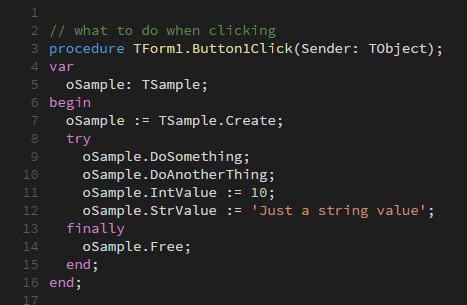
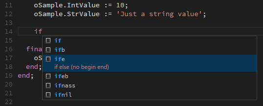

# iRite for Visual Studio Code

This extension adds support for the iRite Language to Visual Studio Code. It supports:

* Syntax Colorization
* Snippets
* Preprocessing
* Compiling
* Deployment to Indicator

# Installation

Launch VS Code Quick Open (Ctrl+P), type the following command: "ext install irite", and hit enter. You now have syntax highlighting and snippets.

## Compilation and Deployment

* Hit Ctrl+Shift+B and select Configure Task Runner, select Other.
* Paste this into your tasks.json generated folder (modify the command path to point to the iRite_preprocessor).
{
    "version": "0.1.0",
    "command": "C:/(exe path)/iRite_preprocessor.exe",
    "args": ["${fileDirname}/${fileBasename}", "${fileDirname}"],
    "isShellCommand": false,
    "isBuildCommand": true,
    "showOutput": "always",
    "problemMatcher": {
        "owner": "cpp",
        "fileLocation": ["relative", "${workspaceRoot}"],
        "pattern": {
                    "regexp": "((([A-Za-z]):\\\\(?:[^\\/:*?\\\"<>|\\r\\n]+\\\\)*)?[^\\/\\s\\(:*?\\\"<>|\\r\\n]*)\\((\\d+)\\):\\s.*(fatal|error|warning|hint)\\s(.*):\\s(.*)",
                    "file": 1, 
                    "line": 4,
                    "severity": 5,
                    "code": 6,
                    "message": 7
                }
    }
}

* Hit Ctrl+Shift+B again, the iRite processor has now generated an irite.settings.json file in your project directory.
* Modify the settings file to your preferences.
* Hit Ctrl+Shift+B and you should be building/deploying.

### irite.settings.json

Defaults are established on build, but must be modified for which indicator you are deploying to. 
* deploy: Deploy to indicator after the compilation? Yes or No
* indicator: 1280, 920, 880, 820
* ipaddress: If using TCP connection
* tcpport: If using TCP connection 
* comport: If using RS232
* baudrate: If using RS232
* databits: If using RS232
* parity: If using RS232
* stopbits: If using RS232

# Colorization

Full syntax highlight for iRite

# Snippets

Over 120 snippets available:

