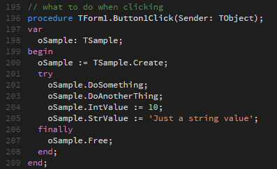

# Pascal language support in Visual Studio Code

Add support to **Pascal** language in **Visual Studio Code**.

_Originally converted from the [Pascal TextMate bundle](https://github.com/alefragnani/pascal.tmbundle)._

### What is it?

You get:

* Syntax Highlighting
* Snippets

There is also a **Task Example**, which allows you to:

* Compile Delphi Projects:
* Navigate to _Errors/Warnings/Hints_, using the native _View / Errors and Warnings_ command

### Installation

This instructions are for _version 0.9.1 and up_, which brings oficial extension support.

Simply clone this repo on the extensions folder and start using

* **Windows**: `%USERPROFILE%\.vscode\extensions`
* **Mac**: `%HOME%\.vscode\extensions`
* **Linux**: `%HOME%\.vscode\extensions`

### Building Tasks

If you want to build tasks _(Task: Run Task Build)_ you can use the snippets below.

#### Delphi

Update two tags:

* `DCC32.EXE_PATH`: The compiler location
* `YOUR_DELPHI_PROJECT.DPR`: The project being built.

    {
		"version": "0.1.0",
		"windows": {
			"command": "DCC32.EXE_PATH"
		},
		"isShellCommand": true,
		"showOutput": "always",
		"args": ["YOUR_DELPHI_PROJECT.DPR"],
		"problemMatcher": {
			"owner": "external",
			"pattern": {
				"regexp": "^([\\w]+\\.(pas|dpr|dpk))\\((\\d+)\\)\\s(Fatal|Error|Warning|Hint):(.*)",
				"file": 1,
				"line": 3,
				"message": 5
			}
		}
    }

### Compatibility

The plugin is primarily compatible to **Delphi** variant of **Pascal**, but **FreePascal/Lazarus** support is on the roadmap.

### Participate

Contributions are greatly appreciated. Please fork this repository and open a pull request to add snippets, make grammar tweaks, etc.
