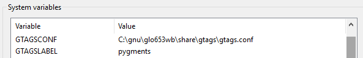

## GNU Global alətini quraşdır

4 alət quraşdırmalısınız:

* GNU Global 6.5 və ya daha yeni versiya (http://www.gnu.org/software/global/global.html) 
* Exuberant Tags 5.5 və ya daha yeni versiya (http://ctags.sourceforge.net/)
* Python 2.7 və ya daha yeni versiya (https://www.python.org/)
* Python Pygments (`pip install Pygments` vasitəsilə)

`%PATH%` mühit dəyişənini yenilə (_Sistem_)

> Tutaq ki, GNU Global və CTags arxivlərini `C:\gnu` qovluğuna çıxarmısınız. `%PATH%` daxilindəki iki yeni qeyd belə olmalıdır:
 
* GNU Global: `C:\gnu\glo653wb\bin`
* Exuberant Tags: `C:\gnu\ctags58\ctags58`

> Python alətinin də `%PATH%` daxilində olduğuna əmin olun

2 yeni mühit dəyişəni yaradın (_Sistem_)

GNU Global Pascal mənbə kodunu tanımaq üçün CTags + Python Pygments alətlərindən plagin kimi istifadə edir, buna görə də onları konfiqurasiya etməlisiniz. 

* `GTAGSCONF`: `C:\gnu\glo653wb\share\gtags\gtags.conf` 
* `GTAGSLABEL`: `pygments`

