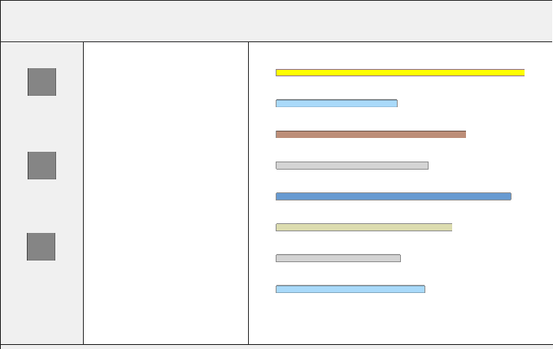
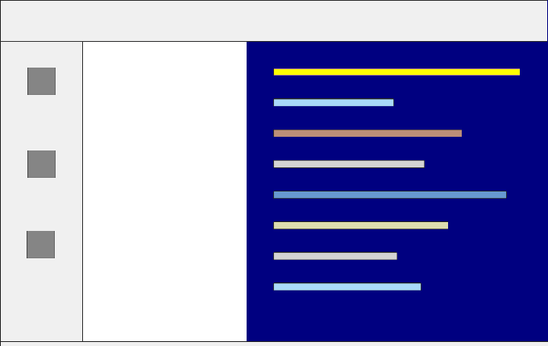
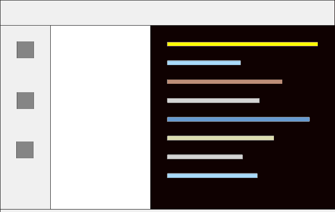
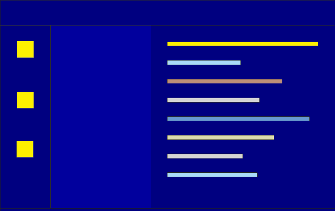
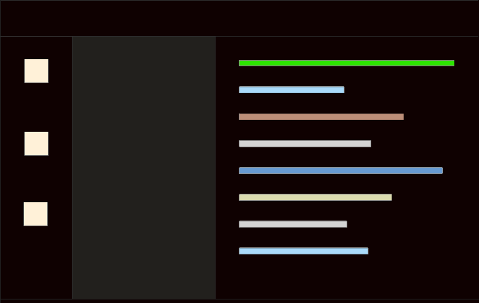

<table align="center" width="85%" border="0">
  <tr>
    <td align="center">
       
      Default
    </td>
    <td align="center">
       
      Classic
    </td>
    <td align="center">
       
      Twilight
    </td>
  </tr>
</table>

<table align="center" width="60%" border="0">
  <tr>
    <td align="center">
       
      Classic+
    </td>
    <td align="center">
       
      Twilight+
    </td>
  </tr>
</table>

<table align="center" width="85%" border="0">
  <tr>
    <td align="center">
      <a title="Install Delphi Themes" href="command:_pascal.installDelphiThemes">Install Themes</a>
    </td>
  </tr>
</table>