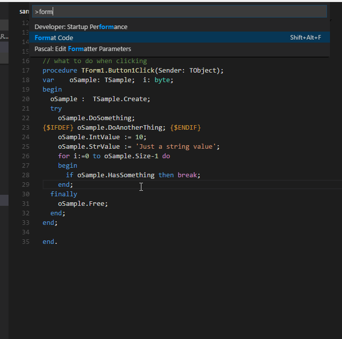

## Pascal Formatter Extension

Use the [Pascal Formatter](command:_pascal.installPascalFormatter) extension to format your code. 

You an choose choose between **Jedi Code Format**, **FreePascal PToP** or **Embarcadero Formatter**

<table align="center" width="85%" border="0">
  <tr>
    <td align="center">
      <a title="Install Pascal Formatter" href="command:_pascal.installPascalFormatter">Install Pascal Formatter</a>
    </td>
  </tr>
</table>